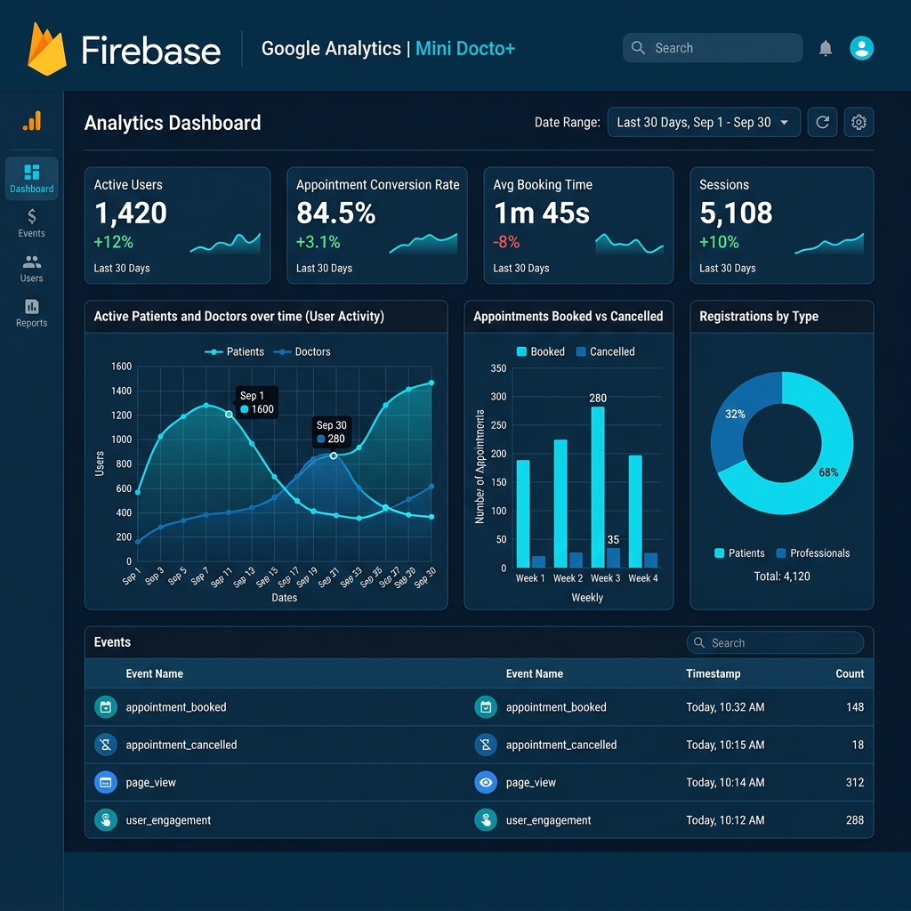

# Mini Docto+

Mini Docto+ est une mini-application de mise en relation entre patients et professionnels de sante.

Le projet contient trois applications:

- `backend/`: API REST Spring Boot + MongoDB.
- `pro-web/`: interface web React/Vite pour les professionnels.
- `patient-mobile/`: application Flutter pour les patients.

## Fonctionnalites couvertes

### Authentification

- Inscription et connexion patient (`role: patient`) depuis Flutter.
- Inscription et connexion professionnel (`role: pro`) depuis React.
- Authentification par JWT.
- Routes separees et protegees par role:
  - `/api/patients/**`: reserve aux patients.
  - `/api/pros/**`: reserve aux professionnels.

### Patient mobile Flutter

- Consulter les professionnels disponibles.
- Afficher les professionnels tries par score decroissant.
- Consulter les creneaux disponibles d'un professionnel.
- Reserver un rendez-vous.
- Consulter ses rendez-vous.
- Modifier uniquement ses propres rendez-vous.
- Annuler uniquement ses propres rendez-vous.

### Professionnel web React

- Ajouter des creneaux de disponibilite.
- Supprimer ses propres creneaux.
- Consulter les rendez-vous reserves par les patients.

## Prerequis

- Java 17.
- MongoDB local ou MongoDB Atlas.
- Node.js + npm.
- Flutter SDK.

## Configuration backend

Le backend ecoute par defaut sur `http://localhost:5000`.

Fichier: `backend/src/main/resources/application.properties`

```properties
server.port=5000
spring.data.mongodb.uri=mongodb://localhost:27017/minidoctoplus
doctoplus.jwt.secret=doctoplus_secret_key_2026_super_secure_987654321_spring
doctoplus.jwt.expiration=2592000000
```

Pour MongoDB Atlas, remplacez `spring.data.mongodb.uri` par l'URL Atlas.
En production, utilisez une variable d'environnement ou un secret pour la cle JWT.

## Lancer le backend

```bash
cd backend
./mvnw spring-boot:run
```

Sur Windows:

```powershell
cd backend
.\mvnw.cmd spring-boot:run
```

Swagger est disponible sur:

```text
http://localhost:5000/swagger-ui/index.html
```

## Lancer l'espace professionnel web

```bash
cd pro-web
npm install
npm run dev
```

L'application Vite est generalement disponible sur:

```text
http://localhost:5173
```

En developpement, vous pouvez utiliser `VITE_API_URL=/api` pour passer par le proxy Vite.
Pour appeler directement le backend:

```env
VITE_API_URL=http://localhost:5000/api
```

## Lancer l'application patient Flutter

```bash
cd patient-mobile
flutter pub get
flutter run
```

L'URL API est resolue dans `patient-mobile/lib/config/api_config.dart`:

- Android emulator: `http://10.0.2.2:5000/api`
- iOS simulator, desktop et web: `http://localhost:5000/api`
- Appareil physique: lancer avec l'IP locale de votre machine:

```bash
flutter run --dart-define=API_HOST=192.168.1.10
```

Remplacez `192.168.1.10` par l'adresse IP locale du PC qui lance le backend.

## Tests et verification

Backend:

```bash
cd backend
./mvnw test
```

Web pro:

```bash
cd pro-web
npm run lint
npm run build
```

Flutter:

```bash
cd patient-mobile
flutter analyze
flutter test
```

## Deploiement Vercel

Vercel convient pour deployer `pro-web` uniquement. Le backend Spring Boot doit etre deploye separement, par exemple sur Render, Railway, Fly.io ou un VPS, avec MongoDB Atlas.

Etapes Vercel:

1. Pousser le projet sur GitHub.
2. Creer un nouveau projet sur Vercel.
3. Choisir le dossier racine `pro-web`.
4. Configurer:
   - Framework Preset: `Vite`
   - Build Command: `npm run build`
   - Output Directory: `dist`
5. Ajouter la variable d'environnement:

```env
VITE_API_URL=https://votre-backend-deploye.com/api
```

6. Deploy.

Si le backend reste local, l'application Vercel ne pourra pas l'appeler depuis Internet. Il faut une API publique et configurer CORS cote Spring Boot.

## Capture Firebase / Google Analytics

Une capture est deja presente dans le projet:

```text
firebase_analytics.png
```

Elle est affichee ci-dessous:



Pour faire votre propre capture:

1. Ouvrir Firebase Console ou Google Analytics.
2. Selectionner le projet Mini Docto+.
3. Aller dans Analytics, Dashboard, Events ou Realtime.
4. Verifier que les evenements importants apparaissent, par exemple:
   - `patient_registered`
   - `pro_registered`
   - `appointment_booked`
   - `appointment_modified`
   - `appointment_cancelled`
5. Faire une capture d'ecran du tableau et l'ajouter au repo, par exemple `firebase_analytics.png`.

## Securite

- Les mots de passe sont hashes avec BCrypt avant stockage.
- Les sessions sont stateless et basees sur JWT.
- Spring Security protege les routes API.
- Les routes patient et professionnel sont separees par role.
- Les rendez-vous patient sont filtres par l'utilisateur connecte.
- La modification et l'annulation d'un rendez-vous verifient que le rendez-vous appartient bien au patient connecte.
- Les professionnels ne peuvent supprimer que leurs propres creneaux.
- CORS est configure pour le developpement. En production, il faut remplacer l'origine ouverte par les domaines deployes.

## Performance

- MongoDB indexe l'email utilisateur pour eviter les doublons et accelerer la recherche.
- Les creneaux utilisent un index compose unique `pro + date + startTime` pour eviter les doublons.
- Les rendez-vous utilisent un index unique sur `slot` pour eviter la double reservation.
- Le tri des professionnels par score decroissant est fait cote backend via `findByRoleOrderByScoreDesc`, ce qui evite un tri inutile cote mobile.
- Les reponses API renvoient seulement les informations utiles aux interfaces, sans mot de passe.

## Etat de validation locale

Commandes verifiees:

- `backend`: `.\mvnw.cmd test`
- `pro-web`: `npm.cmd run lint`
- `pro-web`: `npm.cmd run build`

Flutter n'a pas pu etre execute dans cet environnement car le SDK Flutter n'est pas installe dans le shell utilise. Les commandes a lancer localement sont listees dans la section Tests et verification.
